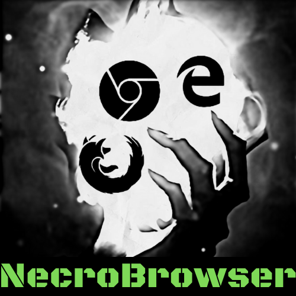

<p align="center">
  
</p>

## About

Necrobrowser is a browser instrumentation microservice written in NodeJS: 
it uses the Puppeteer library to control instances
of Chrome or Firefox in headless and GUI mode.

The idea is to feed NecroBrowser with web sessions harvested during phishing campaigns 
(see Muraena) to quickly perform actions hijacking the victim session.

Post-phishing automation is an often underestimated activity that helps with:
 - performing actions after successful session harvesting on campaigns with hundreds/thousands targets
 - backdooring accounts with new keys or credentials
 - performing automated password resets on third-party portals
 - scraping and extruding information
 - impersonating users to further exploit trust relationships

Each authenticated session is instrumented in its own Chrome browser in Incognito mode,
and can be kept alive to be reused after an initial set of automated tasks are launched.

Since NecroBrowser is just a browser instrumentation tool, you can also write 
automation for other red teaming phases, for example initial Reconnaisance and OSINT.

There are plenty of use cases, for instance:
 - keep N fake personas on LinkedIn/Twitter/YourSocialNetwork active on Chrome to monitor/scrape info from your targets
 - automatically build Social Network connections 
 - automate interaction with target contact forms/chats to get target info

In other words, NecroBrowser allows you to define your Puppeteer tasks in advance,
which you can then call on a cluster of headless browsers, with durable local SQLite persistence.


## Safe policy and cookie-jar dry run

Service now includes safe validation infrastructure only. `POST /cookie-jar/dry-run` accepts an exported JSON cookie jar, validates shape, limits, domains, expiry, and policy, then returns redacted diagnostics. It never stores, applies, or replays cookies and never starts a browser task.

`GET /healthz` returns sanitized liveness. Local runtime enables HTTP and private-network navigation by default because NecroBrowser is intended to run with local dependencies and fixtures. Set `allowPrivateNetworks = false` or `allowHttp = false` to restore blocking. Submitted Cookie-Editor jars are validated before queueing, stored in protected SQLite, normalized, and injected before each task's first navigation. `/cookie-jar/dry-run` remains validation-only.

Cookie-jar dry run is not authenticated session replay. No public-site cookie injection or disruptive test mode is included.

Navigation validation rejects non-HTTP(S) schemes and URL credentials. Active task modules use injected pool pages, normalized cookie jars, configured output paths, and propagated failures. Local pre-migration copies, when needed, belong under the ignored `custom.local/` folder; runtime never loads them.

## Runtime architecture

NecroBrowser separates HTTP routes, local SQLite persistence, and browser scheduling. `lib/app.js` exposes a dependency-injected Express app for fast API tests. `browser/pool.js` owns bounded concurrency, task timeouts, retries, profile isolation, metrics, and browser cleanup. `necrobrowser.js` is process entrypoint plus graceful shutdown wiring.

Default runtime uses stock Puppeteer and stores task/session data in `./necro.db`. Browser work runs only through the pool; task modules must not close pool-owned pages or browsers. The database contains session cookies and must remain outside public directories with restrictive file permissions. SQLite persistence is local to one NecroBrowser process; it is not a distributed queue.

## Optional Cloakbrowser launcher

For authorized lab/CTF targets, install dependencies with:

```bash
npm install
```

Set this opt-in configuration to use Cloakbrowser's Puppeteer adapter instead of stock Puppeteer:

```toml
[necro.cloak]
enabled = true
humanize = true
```

Restart Necrobrowser after changing configuration. `enabled = false` (default) keeps stock Puppeteer. Cloakbrowser resolves its own Chromium binary; `platform.puppetPath` applies to stock Puppeteer mode only. Cloakbrowser launch options can be supplied under `[necro.cloak]`, including `licenseKey`, `browserVersion`, `releaseChannel`, `locale`, `timezone`, `humanPreset`, `humanConfig`, `stealthArgs`, and `geoip`.

Task `params.userAgent` remains explicit and is applied by `ConfigureUserAgent()` before navigation, overriding any launch-time default. Use only against systems and sessions you own or are authorized to test.

## Testing

Default suite is deterministic: no fixed port, detached server, public network, or global database cleanup.

```bash
npm test
npm run test:unit
npm run test:integration
npm run check
```

Real browser tests should use local fixtures and temporary profile/output directories. Run the local end-to-end workflow with `npm run test:e2e`; it verifies cookie injection, cookie-gated UI, click/type interaction, form submission, screenshot creation, and SQLite result storage. The optional `npm run test:e2e:external` smoke test visits `example.com` and requires intentional network availability. External account workflows stay opt-in.

The E2E suite never adds generic click/type automation to production task modules. It registers a test-only task so production behavior remains unchanged.

## Documentation

Full navigable documentation: [necrobrowser.phishing.click](https://necrobrowser.phishing.click/).

- [Setup](https://necrobrowser.phishing.click/setup)
- [Configuration](https://necrobrowser.phishing.click/config)
- [REST API](https://necrobrowser.phishing.click/api)
- [Task catalog](https://necrobrowser.phishing.click/tasks)
- [Examples](https://necrobrowser.phishing.click/examples)
- [Testing](https://necrobrowser.phishing.click/testing)
- [CLI](https://necrobrowser.phishing.click/cli)
- [Architecture](https://necrobrowser.phishing.click/architecture)
- [Coding-agent guidance](https://necrobrowser.phishing.click/development/agents)

## Contributing

1. Fork it!
2. Create your feature branch: `git checkout -b my-new-feature`
3. Commit your changes: `git commit -am 'Add some feature'`
4. Push to the branch: `git push origin my-new-feature`
5. Submit a pull request 🤩

See the list of [contributors](https://github.com/muraenateam/necrobrowser/contributors) who participated in this project.

## License

**Necrobrowser** is made with ❤️ by [the dev team](https://github.com/orgs/muraenateam/people) and it's released under the <a href="https://github.com/muraenateam/necrobrowser/blob/master/LICENSE.md"></a>.
library to interface with Chrome. It turned out the library was not reliable
in some advanced cases we had in production.
